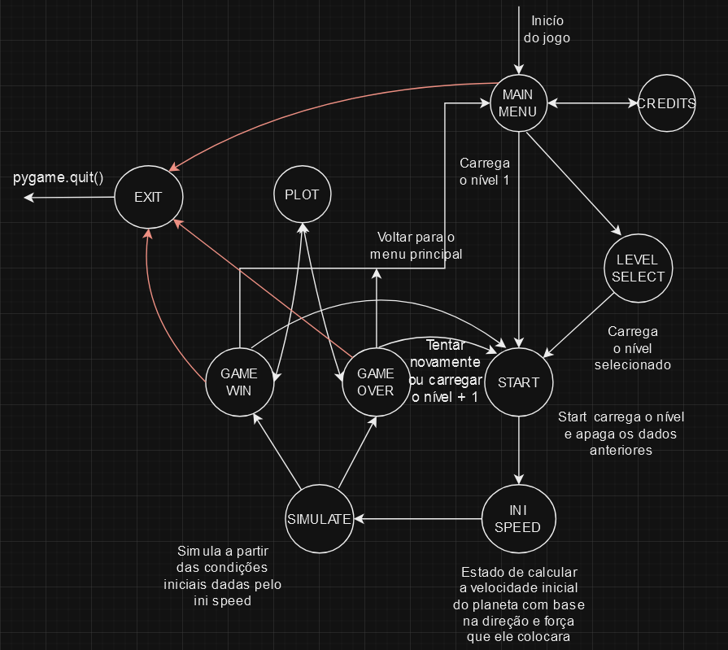

# Descrição do projeto

Este projeto foi criado para simular o comportamento da força gravitacional sob um corpo em movimento. O objetivo deste projeto é desenvolver nos jogadores uma noção intuitiva do modelo físico de gravitação universal e suas propriedades (tal qual leis de Kepler, por exemplo) através de uma experiência lúdica. Para vencer, o jogador deve fazer um lançamento oblíquo da bola vermelha para que ela atinja o retângulo verde, levando em conta as forças gravitacionais advindas de corpos adjacentes. Após cada lançamento, pode-se visualizar um gráfico da variação da energia potêncial gravitacional e cinética ao longo do decorrer da simulação. Com isso, sedimentando a habilidade e a intuição de ler e interpretar as informações de um sistema físico.

### Por que a noção intuitiva é importante?

Todo modelo físico vem de uma pessoa curiosa com seu ambiente, tentando transformar suas observações e entendimentos em um sistema preciso e livre de ambiguidades. Porem tal precisão pode vir a custo do entendimento de um leitor desacostumado à literatura acadêmica. Visto isso, é muito mais aconselhável primeiro aclimatar tal leitor aos conceitos da física através de uma noção intuitiva dos tópicos abordados, como, no caso do projeto, a utulização de um jogo interativo. A partir disso, o leitor poderá melhor entender a mentalidade do autor ao escrever uma obra acadêmica e a lógica por trás de seus argumentos e definições.

# Implementação

O jogo foi desenvolvido em Python 3 com o auxílio dos pacotes pygame, numpy, scipy e matplotlib para o desenvolvimento do projeto. Estas bibliotecas serviram para a criação da interface gráfica, portabilidade, obtenção e gerenciamento dos comandos do usuário, colisão entre objetos e também para o cálculo das interações entre objetos do jogo.

A forma na qual a simulação dos conceitos físicos fora implementada pode ser encontrada na [implementação da engine de física](./engine/subsystems/phys_xd.py) e a implementação dos gráficos pode ser encotrada na [implementação da engine de gráficos](./engine/subsystems/rendering.py).

O funcionamento do jogo como um todo, o qual utiliza de todos os aspectos relacionados a física e a renderização é descrito pela seguinte máquina de estados:

# Conceitos de Física e modelo matemático

## Gravitação Universal

A lei da gravitação universal diz respeito à força mútua entre dois corpos e é voltada ao centro de massa do sistema; ela é proporcional à massa dos corpos e inversamente proporcional à distância entre eles. Essa lei é muito útil para o cálculo da órbita de planetas e trajetórias sujeitas à força gravitacional como a de um foguete ou, no nosso caso, um asteróide vermelha. Graças a essa lei, podemos desenvolver a seguinte equação para a força central gravitacional: 

$\vec{F_g} = -G \times \frac{Mm}{d^2}\hat{r}$ 

onde $G$ é a constante de gravitação, que vale $6,67\times10^{-11} N.m^2/kg^2$, $d$ a distância entre os corpos, $M$ e $m$ a massa do maior e menor corpo respectivamente e $\hat{r}$ o versor radial centrado no centro de massa do corpo sobre o qual a força atua.

## Lançamento Oblíquo

O lançamento oblíquo é o arremesso diagonal de um objeto em um sistema conservativo sob efeito da força gravitacional, por exemplo a trajetória simplificada de uma flecha ou a simulação de um asteróide tentando atinjir um retângulo verde. Seja o arremesso um ganho instantâneo de velocidade $\vec{v}$ e $N$ o número de corpos próximos a nossa bolinha vermelha, podemos representar as forças atuantes nesse sistema da seguinte maneira:
 
$\vec{F} = \sum_{k=1}^{n} -G\frac{M_km}{d_k^2}\hat{r_k}­$   
 
onde $M_k$ é a massa do K-ésimo planeta, $d_k$ a distância do planeta à bola e $\hat{r_k}$ o vetor radial centrado no K-ésimo planeta.

Aplicando esta relação para todos os planetas presentes no sístema obtem-se a relação que descreve a aceleração para todos os planetas.

Podemos produzir uma aproximação eficiente deste sistema utilizando o método de intergração de verlet.
Sabemos que a equação cinemática para um corpo em um sistema de forças é da seguinte forma:

$x(t) = x_0 + v_0t + \frac{1}{2}at^2 + \frac{1}{6}bt^3 + ...$ 

É possível aproximar o próximo valor $x$ em $t + \Delta t$ da seguinte maneira, fazendo a expansão de taylor:

$x(t + \Delta t) = x(t) + v(t)\Delta t + \frac{1}{2}a(t)\Delta t^2 + \frac{1}{6}b(t)\Delta t^3 + O(t^4)$ 

Como, para a nossa simulação, não sera calculado o "jerk", a equação pode ser simplificada para:

$x(t + \Delta t) = x(t) + v(t)\Delta t + \frac{1}{2}a(t)\Delta t^2 + O(t^3)$ 

Portanto é possível fazer uma aproximação cujo é necessario saber apenas das funções da velocidade e posição.

A partir disso, o método de Verlet utiliza da posição atual e anterior para aproximar esta equação com a seguinte relação:

$x_{n-1} + x_{n + 1} = 2x_n + a_n(\Delta)^{2} + O[(\Delta t)^4] $

A partir subtração da série de taylor para $x_{n + 1}$ e $x_{n - 1}$ obtemos o verlet para posições:

$v_n = \frac{x_{n + 1} - x_{n - 1}}{2 \Delta t}$

Que tem um erro de terceira ordem para a posição e de segunda ordem para a velocidade.

Entretanto, a implementação do método de Verlet requer que a posição anterior do corpo seja salava. Para evitar isso foi utilizado do Velocity Verlet que é uma equação matematícamente equivalente ao método de verlet. A relação deste método é dada a seguir:

$x_{n + 1} = x_n + v_{n}\Delta t + \frac{1}{2}a_{n}(\Delta t)^{2}$

(Abaixo é o verlet para a velocidade)

$v_{n + 1} = v_{n} + \frac{1}{2}(a_{n + 1})\Delta t$

Em que $a_{n + 1}$ é caculado para um corpo de massa $m$ da seguinte, utilizando a segunda lei de newton:

$a(t + \Delta t) = f(x(t + \Delta t)) \quad, f(x) = \sum_{k=1}^{n}{G \times \frac{M_k}{d_k^2}}\hat{r}$ 

Com isso é aproximado a trajetória do movimento do asteroide jogado.

# Como instalar

## Instalação dos pacotes
Primeiramente garanta que o computador possua python 3.10+. Depois, instale os seguintes módulos pelo terminal de comando usando pip install nome do modulo pygame, numpy, scipy, matplotlib.

# Execução e jogabilidade

Para rodar o jogo, execute o seguinte comando dentro da diretória do jogo: "py main.py". Para jogar arraste o mouse da bola para a direção desejada; quanto maior a distância do mouse para a bola vermelha, maior a magnitude do vetor velocidade aplicado sobre ela.

## Autores

Este jogo foi desenvolvido por Vinicius Freitas, Rodrigo Almeida, João Mello, Glauco Fleury e João Dias.

## Referências 

-Conceitos sobre gravitação, movimento oblíquo, e dinâmica (forças e aceleração): pdf's do professor-doutor Esmerindo de Souza Bernardes (email oficial = sousa@ifsc.usp.br);

-Método Velocity-Verlet: Velet method · University of Delaware - Computational Methods of Physics. Disponível em https://www.physics.udel.edu/~bnikolic/teaching/phys660/numerical_ode/node5.html .
-Método Velocity-Verlet: VERLET Integration · Arcane Algorithm Archive. Disponível em: https://www.algorithm-archive.org/contents/verlet_integration/verlet_integration.html .
-Método Velocity-Verlet: As bases da Dinâmica Molecular - 2 · UFPEL. Disponível em: https://wp.ufpel.edu.br/diehl/files/2018/09/SCEF_MD_aula2.pdf .

